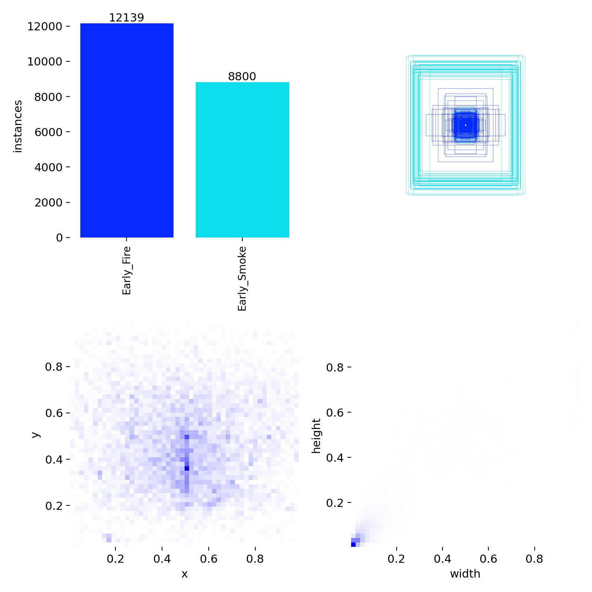
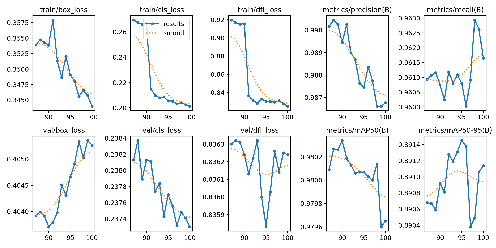
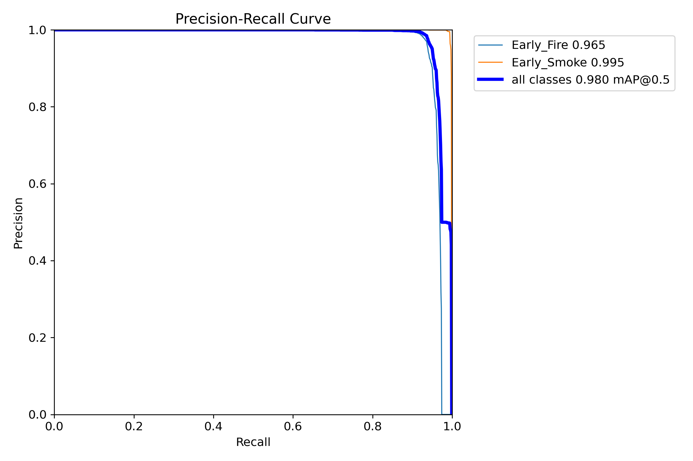
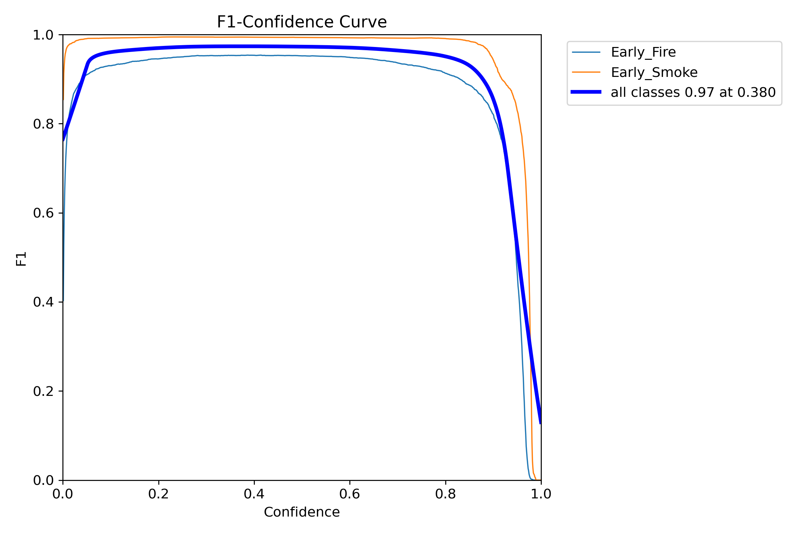
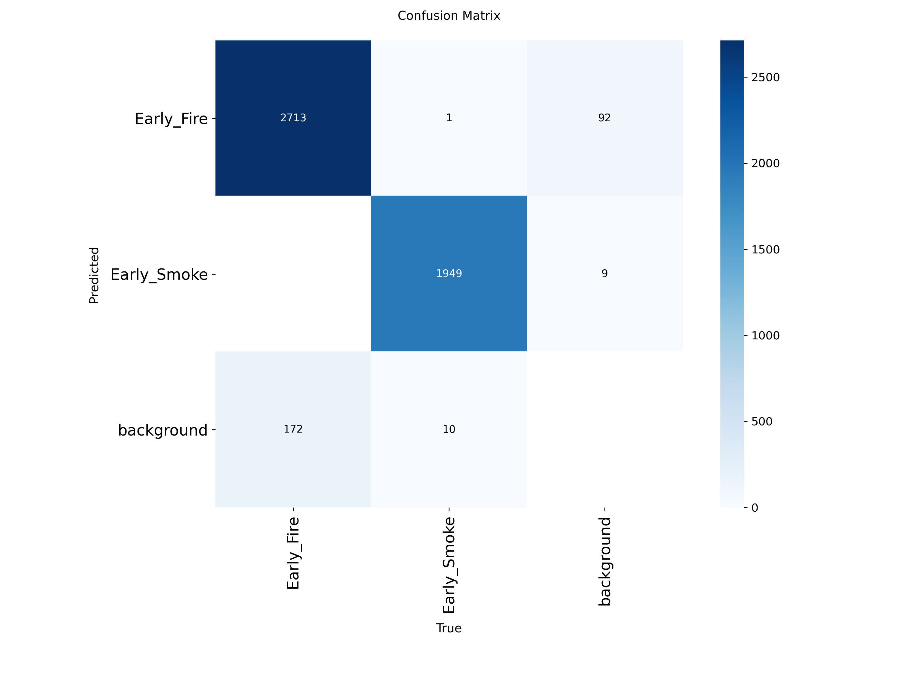
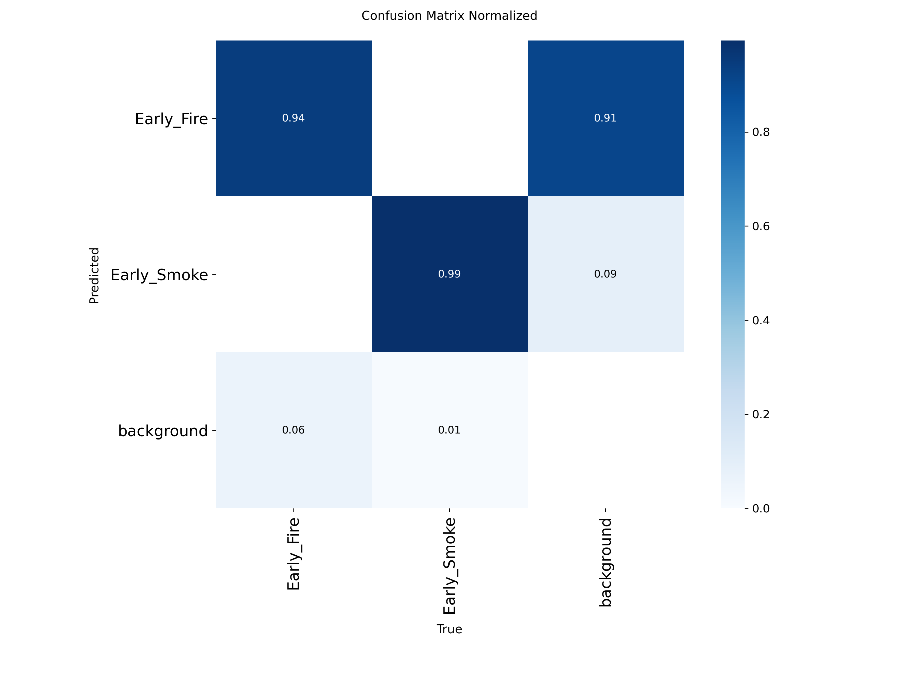
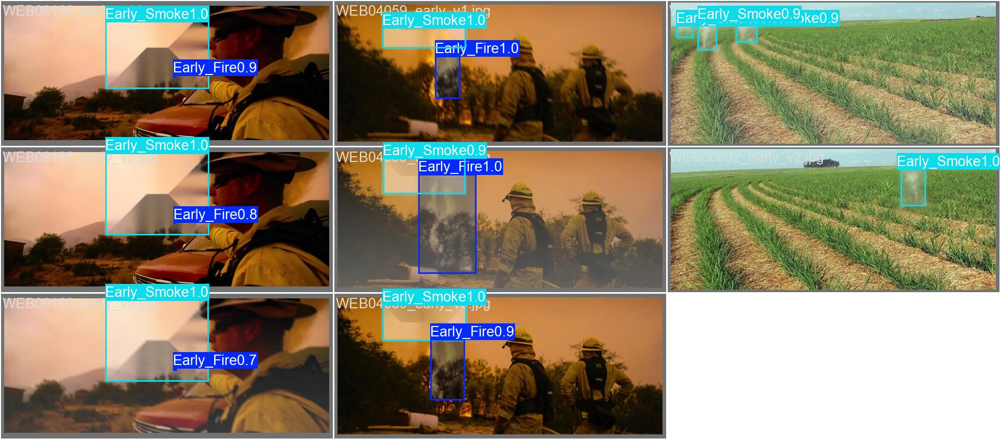
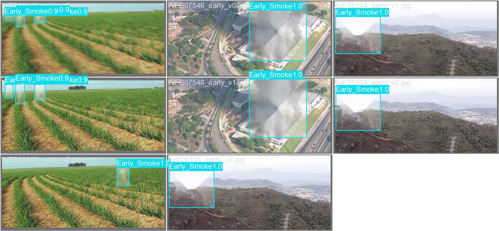
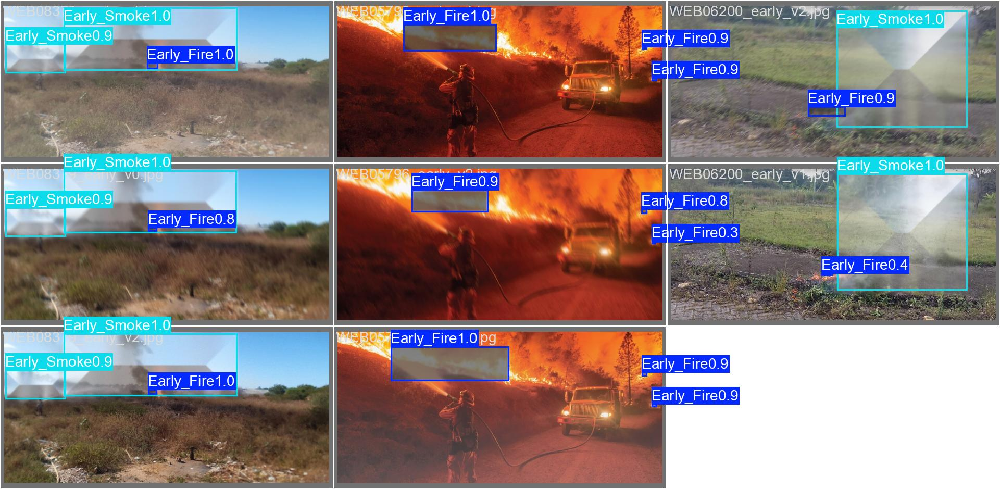

# 🔥 UAV Wildfire Early Detection System
> **Real-time Early Fire & Smoke Detection from UAV Aerial Imagery using YOLOv11**
[](https://python.org)
[](https://docs.ultralytics.com)
[](https://onnxruntime.ai)
[](LICENSE)
---
## Abstract
Wildfires pose an increasing threat to ecosystems, communities, and infrastructure worldwide. Early detection is critical to minimizing damage and enabling rapid response. This project presents a **deep learning–based wildfire early detection system** designed to operate on imagery captured by **Unmanned Aerial Vehicles (UAVs)**.
We leverage the **YOLOv11n** (nano) architecture — a state-of-the-art real-time object detection model — fine-tuned to identify two critical early indicators of wildfire:
- 🔴 **Early Fire** — nascent flame regions visible from aerial perspectives
- 🟠 **Early Smoke** — smoke plumes indicative of fire ignition or smoldering
The system achieves **97.97% mAP@50** and **89.11% mAP@50-95** on our validation set, demonstrating robust detection capability across diverse environmental conditions. The model is optimized for deployment using **ONNX Runtime**, enabling efficient inference on both edge devices and cloud platforms.
---
## Dataset
The training dataset comprises UAV aerial imagery annotated with bounding boxes for two classes:
| Class | Instances | Description |
|---|---|---|
| **Early_Fire** | 12,139 | Early-stage flame regions |
| **Early_Smoke** | 8,800 | Smoke plumes from fire ignition |
| **Total** | **20,939** | — |
### Label Distribution

---
## Model Architecture & Training
### Architecture
- **Base Model**: YOLOv11n (nano variant) — optimized for real-time inference
- **Input Resolution**: 1280×1280 pixels
- **Pre-trained**: Yes (COCO weights → fine-tuned on wildfire dataset)
### Training Configuration
| Parameter | Value |
|---|---|
| **Optimizer** | AdamW |
| **Initial Learning Rate** | 0.001 |
| **Final Learning Rate** | 0.01 (cosine annealing) |
| **Batch Size** | 4 |
| **Epochs** | 100 |
| **Patience** | 50 (early stopping) |
| **Image Size** | 1280×1280 |
| **AMP** | Enabled (mixed precision) |
### Data Augmentation
- Mosaic (p=1.0) + MixUp (p=0.1) + CopyPaste (p=0.1)
- RandAugment + HSV jitter + horizontal flip
- Random erasing (p=0.4) + rotation (±5°) + scaling (0.3)
### Training Platform
- **Hardware**: 2× NVIDIA Tesla T4 (16 GB VRAM each)
- **Platform**: Kaggle Notebooks
- **RAM**: 32 GB
- **CUDA**: 13.0
---
## Performance Metrics
### Final Results (Best Checkpoint)
| Metric | Value |
|---|---|
| **Precision** | 98.68% |
| **Recall** | 96.16% |
| **mAP@50** | 97.97% |
| **mAP@50-95** | 89.11% |
| **F1 Score** | 0.97 @ confidence=0.380 |
### Per-Class Performance
| Class | AP@50 | Precision | Recall |
|---|---|---|---|
| **Early_Fire** | 96.5% | ~98.7% | ~94.0% |
| **Early_Smoke** | 99.5% | ~98.7% | ~99.5% |
### Training Curves

### Precision-Recall Curve

### F1-Confidence Curve

### Confusion Matrix

### Normalized Confusion Matrix

### Validation Predictions



---
## Project Timeline
| Date | Milestone | Description |
|---|---|---|
| **June 2026 – Week 1** | 📋 Project Planning | Problem definition, dataset sourcing, architecture selection |
| **June 2026 – Week 2** | 📦 Data Preparation | Dataset curation, annotation validation, train/val/test split |
| **June 21, 2026** | 🚀 Phase 1 Training | YOLOv11n training (100 epochs) on Kaggle with 2× Tesla T4 |
| **June 26, 2026** | 🔄 Phase 2 Fine-tuning | Resumed training with optimized hyperparameters |
| **June 27, 2026** | 🌐 Web Demo & Deployment | ONNX optimization, Flask API backend, Vite frontend |
| **June 27, 2026** | ☁️ Cloud Deployment | Backend on Google Cloud Run, Frontend on Firebase Hosting |
---
## System Architecture
```
┌─────────────────────────────┐      HTTPS API       ┌──────────────────────────────┐
│   FRONTEND                  │ ◄──────────────────►  │    BACKEND                   │
│                             │                       │                              │
│   Vite + Tailwind CSS v4    │   POST /api/detect/*  │    Flask + ONNX Runtime      │
│   Firebase Hosting          │   GET  /api/model-info│    best.onnx (YOLOv11n)      │
│   Static SPA                │                       │    Google Cloud Run          │
└─────────────────────────────┘                       └──────────────────────────────┘
```
---
## Getting Started
### Prerequisites
- Python 3.10+
- Node.js 18+
- Google Cloud SDK (for deployment)
### 1. Clone & Setup Export Environment
```bash
git clone <repository-url>
cd dsp-uav
# Create export venv (one-time, for ONNX conversion)
python -m venv .venv
.\.venv\Scripts\Activate.ps1   # Windows
pip install -r requirements-export.txt
# Export model to ONNX
python scripts/export_onnx.py
deactivate
```
### 2. Backend Setup
```bash
cd backend
python -m venv .venv
.\.venv\Scripts\Activate.ps1
pip install -r requirements.txt
# Run locally
python app.py
# API available at http://localhost:8080
```
### 3. Frontend Setup
```bash
cd frontend
npm install
npm run dev
# App available at http://localhost:5173
```
### 4. Deploy
```bash
# Backend → Cloud Run
# Frontend → Firebase Hosting
# See deployment documentation for details
```
---
## License
This project is developed for academic and research purposes.
---
## Acknowledgments
- [Ultralytics](https://ultralytics.com/) for the YOLOv11 architecture
- [ONNX Runtime](https://onnxruntime.ai/) for optimized inference
- [Kaggle](https://kaggle.com/) for compute resources