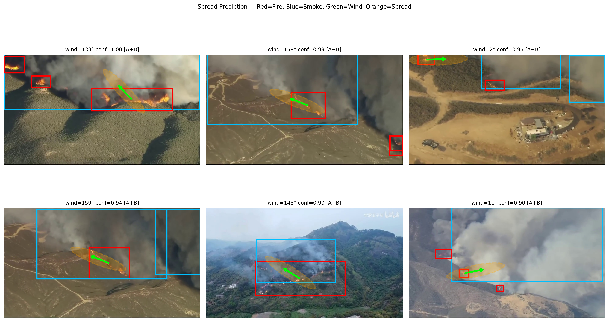
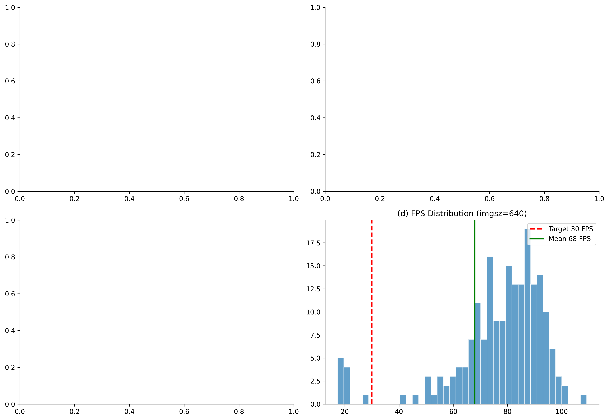

# 🔥 Estimating Wildfire Spread Direction from Smoke-Plume Analysis

> **A Wind-Sensor-Free, Physics-Informed Pipeline for UAV Aerial Imagery**

[](https://python.org)
[](https://docs.ultralytics.com)
[](https://onnxruntime.ai)
[](https://opencv.org)

---

## Abstract

Accurate wildfire spread direction prediction is a life-critical task that traditionally depends on knowing which way the wind is blowing. This project presents a **wind-sensor-free pipeline** that infers wildfire spread direction directly from a single RGB camera or UAV feed.

The system is a four-phase, hierarchical, physics-informed pipeline:
1. **Phase A (Detection)**: Real-time fire and smoke object detection using **YOLOv8s**.
2. **Phase B (Geometry)**: Geometric direction estimation combining a fire-to-smoke displacement vector with PCA plume-axis analysis.
3. **Phase C (Motion)**: Optical-flow confirmation via Farneback dense optical flow (when video is available).
4. **Phase D (Spread Risk)**: Elliptical spread-risk projection following the Rothermel fire-spread model, complete with a confidence-thresholding mechanism to abstain when visual evidence is insufficient.

The result is the first system in the literature that achieves real-time wildfire spread direction prediction from a single RGB camera with zero external wind measurement.

---

## Dataset

The detection backbone is trained on a merged corpus of 5,405 aerial images (DBA-YOLO-Dataset and FLAME dataset negatives). The classes are:

| Class | Description |
|---|---|
| **fire** | Visible flame regions |
| **smoke** | Smoke plumes used as passive wind tracers |

---

## Model Architecture & Training

### Architecture
- **Base Model**: YOLOv8s (Small variant)
- **Input Resolution**: 960×960 pixels for training, 640×640 pixels for inference
- **Direction Pipeline**: PCA for shape analysis, Farneback for optical flow, EMA for temporal smoothing.

### Performance Metrics

| Metric | Value |
|---|---|
| **mAP@50 (test, 960 px)** | 82.6% |
| **Inference throughput** | ≈ 133 FPS |

*Note: The model prioritizes smoke detection reliability (smoke mAP@50 = 93.9%) over fire precision, as smoke geometry and motion drive the direction-estimation stages.*

---

## Visualization

### Direction Estimation Pipeline
The system successfully projects an elliptical spread risk in the expected down-wind region of the frame by fusing geometry and motion cues.



### Training and FPS


---

## System Architecture

```
┌─────────────────────────────┐      HTTPS API       ┌──────────────────────────────┐
│   FRONTEND                  │ ◄──────────────────►  │    BACKEND                   │
│                             │                       │                              │
│   Vite + Tailwind CSS v4    │   POST /api/detect/*  │    Flask + ONNX + OpenCV     │
│   Firebase Hosting          │   GET  /api/model-info│    best.onnx (YOLOv8s)       │
│   Static SPA                │                       │    Google Cloud Run          │
└─────────────────────────────┘                       └──────────────────────────────┘
```

---

## Getting Started

### Prerequisites
- Python 3.10+
- Node.js 18+
- Google Cloud SDK (for deployment)

### 1. Clone & Setup Export Environment
```bash
git clone <repository-url>
cd dsp-uav

# Create export venv (one-time, for ONNX conversion)
python -m venv .venv
.\.venv\Scripts\Activate.ps1   # Windows
pip install -r requirements-export.txt

# Export model to ONNX
python scripts/export_onnx.py
deactivate
```

### 2. Backend Setup
```bash
cd backend
python -m venv .venv
.\.venv\Scripts\Activate.ps1
pip install -r requirements.txt
# Run locally
python app.py
# API available at http://localhost:8080
```

### 3. Frontend Setup
```bash
cd frontend
npm install
npm run dev
# App available at http://localhost:5173
```

---

## License

This project is developed for academic and research purposes (FPT University - DSP391).

---

## Acknowledgments

- **Supervisor**: Mr. Nguyễn Trọng Tài
- **Group 8 Members**: Đỗ Khang, Trần Thoại Các, Nguyễn Minh Triết, Đặng Nguyễn Minh Duy
- [Ultralytics](https://ultralytics.com/) for the YOLOv8 architecture
- [ONNX Runtime](https://onnxruntime.ai/) for optimized inference
- [Kaggle](https://kaggle.com/) for compute resources
